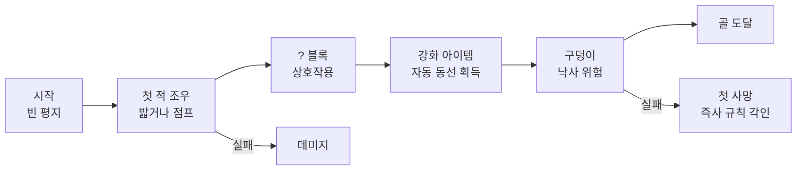
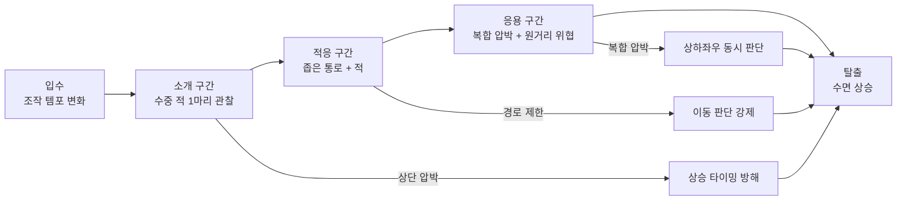
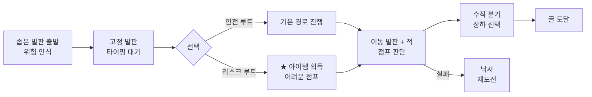

# 2D 횡스크롤 액션 게임 – 스테이지 시스템 기획서

## 문서 개요

각 스테이지는 **학습 스테이지**, **기초 스테이지**, **공중 플랫폼 스테이지**, **보스 스테이지**로 구분되며,

플레이어가 게임을 진행하면서 자연스럽게 조작을 익히고, 환경 변화에 적응하고, 새로운 경험을 만나고, 최종 대결에 도달하는 흐름을 목표로 설계했다.

각 스테이지는 독립된 기획이 아니라, 이전 스테이지에서 플레이어가 습득한 경험을 다음 스테이지에서 활용하고 확장하는 구조로 연결된다.

---

## 학습 스테이지 – 지상 레벨 기본 조작 설계

### 스테이지 개요

이 문서는 플레이어가 게임에서 가장 처음 만나는 학습 스테이지를 설계하면서,

기본 조작과 핵심 규칙을 어떻게 자연스럽게 전달할 수 있는지 정리한 시스템 기획 문서다.

나는 학습 스테이지를 단순한 튜토리얼이 아니라,

**플레이어가 직접 행동하면서 게임의 언어를 체득하는 공간**으로 설계했다.

텍스트 안내나 강제 멈춤 없이, 레벨 구조 자체가 조작법을 가르치는 것을 목표로 했다.

### 스테이지 정보

- 스테이지: 학습 스테이지 – 지상 레벨
- 장르: 2D 횡스크롤 액션 게임 시스템 기획
- 역할: 시스템 기획, 온보딩 설계, 레벨 경험 설계
- 핵심 키워드: 첫 경험, 자연스러운 학습, 안전한 실패, 보상 구조

### 스테이지 목표

게임의 첫 스테이지는 두 가지 과제를 동시에 해결해야 한다.

1. 플레이어에게 이동, 점프, 적 처치, 아이템 획득 등 **핵심 조작을 가르칠 것**
2. 가르치면서도 **"이건 수업이 아니라 게임이다"라는 느낌을 유지할 것**

학습 스테이지의 기획 목표를 네 가지로 정리했다.

1. 이동과 점프를 **안전한 환경에서 자연스럽게 시도**하게 만들기
2. 첫 적과의 조우를 통해 **"밟으면 처치된다"는 규칙**을 체득시키기
3. 상호작용 블록(? 블록)과 강화 아이템을 통해 **환경 탐색의 보상**을 경험시키기
4. 첫 구덩이를 통해 **"떨어지면 죽는다"는 핵심 위험**을 인식시키기

### 핵심 설계

#### 레벨 맵
[S] □□□□ [A] [?] □□ [PIT] □□□ [GOAL]
                ↓
              [★아이템]→→→

##### 레벨 맵 설명
- S: 플레이어 시작 지점
- A: 적
- ?: ? 블록
- PIT: 구덩이
- GOAL: 골
- ★아이템: 강화 아이템

#### 플로우차트


#### 1. 시작 직후 빈 공간을 제공한다

레벨 시작 지점은 적도 장애물도 없는 짧은 평지로 설계했다.

플레이어는 이 구간에서 좌우 이동과 점프를 자유롭게 시도할 수 있다.

위험 요소가 없기 때문에 실패 부담 없이 조작감을 파악하게 된다.

#### 2. 첫 적을 좁은 경로에서 만나게 한다

평지 이후 첫 번째 적은 **플레이어가 피할 수 없는 동선 위**에 배치했다.

이 배치의 의도는 플레이어에게 "적을 어떻게 처리할 것인가"라는 첫 판단을 강제하는 것이다.

점프로 넘거나 밟는 행동 중 하나를 반드시 선택하게 되며,

이 과정에서 **적 처치의 기본 규칙**을 자연스럽게 학습하게 된다.

#### 3. ? 블록으로 상호작용을 유도한다

첫 적 근처에 ? 블록을 배치했다. 블록은 시각적으로 눈에 띄는 디자인으로,

플레이어의 호기심을 자극해 "머리로 받아보자"는 행동을 유도한다.

블록에서 코인이나 강화 아이템이 나오면서,

플레이어는 **"환경과 상호작용하면 보상이 있다"**는 원칙을 체득한다.

#### 4. 강화 아이템의 경로를 설계한다

강화 아이템은 블록에서 나온 뒤 **한 방향으로 굴러가도록** 설계했다.

아이템이 벽에 부딪혀 되돌아오거나, 플레이어의 진행 방향으로 이동하게 만들어서

**별도의 안내 없이도 자연스럽게 획득**하도록 동선을 유도했다.

이를 통해 플레이어는 강화 상태(크기 변화, 능력 추가)를 처음 경험하게 된다.

#### 5. 첫 구덩이로 낙사를 경험시킨다

레벨 중반 이후에 첫 번째 구덩이를 배치했다.

이 구덩이는 점프 없이는 건널 수 없는 폭으로 설계하되,

직전에 **코인 흔적이나 시각적 단서**를 두어 "여기서 점프해야 한다"는 신호를 준다.

만약 떨어지더라도 이것이 플레이어의 **첫 죽음 경험**이 되며,

"구덩이 = 즉사"라는 핵심 규칙을 각인시키는 역할을 한다.

### 설계 방향

#### 1. 난이도 곡선을 완만하게 유지한다

학습 스테이지 전체의 난이도는 의도적으로 낮게 설정했다.

적의 수는 최소한으로 유지하고, 구덩이도 레벨 후반부에만 등장시켰다.

이 구조는 "처음 플레이하는 사람도 끝까지 도달할 수 있는 레벨"을 목표로 한 것이다.

#### 2. 보상을 앞쪽에 집중 배치한다

코인, ? 블록, 강화 아이템은 레벨 초반~중반에 집중 배치했다.

이를 통해 플레이어는 게임 시작 직후부터

**"이 게임은 탐색하면 보상을 준다"**는 인상을 강하게 받게 된다.

#### 3. 숨겨진 요소로 재방문 동기를 심는다

레벨 곳곳에 숨겨진 블록이나 보너스 구간을 배치했다.

첫 플레이에서는 발견하지 못할 수 있지만,

재방문 시 "이런 것도 있었네"라는 발견의 즐거움을 제공한다.

이 요소는 학습 스테이지가 일회성 튜토리얼이 아니라,

**반복 플레이해도 가치가 있는 레벨**임을 보여주는 장치다.

#### 레벨 적용 전략 관점 정리

나는 학습 스테이지를 다음과 같은 설계 전략으로 정리했다.

- **무언의 교육**: 텍스트 없이 레벨 배치만으로 조작법과 규칙을 전달한다.
- **안전한 실험 공간**: 초반에 위험 요소를 제거해 플레이어가 부담 없이 조작을 시도하게 한다.
- **점진적 위험 도입**: 적 → 블록 → 구덩이 순서로 위험 요소를 하나씩 추가해 학습 부하를 분산한다.
- **보상 선행 배치**: 위험보다 보상을 먼저 경험시켜 긍정적 첫인상을 설계한다.

---

## 수중 스테이지

### 스테이지 개요

이 문서는 기초 스테이지의 수중 구간을 설계하면서,

수중 적의 행동 구조를 바탕으로 레벨의 플레이 경험을 어떻게 기획했는지 정리한 시스템 기획 문서다.

학습 스테이지에서 플레이어는 지상 환경에서 이동, 점프, 적 처치 등 기본 조작을 익혔다. 
기초 스테이지는 그 조작 능력을 바탕으로, 이번에는 **수중이라는 특수 환경**에서 적의 압박을 읽고 이동 판단을 내리는 경험을 하게 만드는 단계다.

나는 수중 적을 단순한 장애물이 아니라,

플레이어의 이동 경로와 상승 타이밍을 통제하는 공간 압박형 적으로 설계했다.

이 기획의 목적은 적의 세부 움직임을 설명하는 데 그치지 않고,

그 행동이 실제 레벨 설계에서 어떤 의미를 가지는지 기획 관점으로 연결하는 데 있다.

### 스테이지 정보

- 스테이지: 기초 스테이지 – 수중 레벨
- 장르: 2D 횡스크롤 액션 게임 시스템 기획
- 역할: 시스템 기획, 적 행동 설계, 레벨 경험 설계
- 핵심 키워드: 수중 레벨, 공간 압박, 이동 판단, 레벨 구조

### 스테이지 목표

수중 레벨은 조작 템포가 느려지고 이동 반응이 둔하게 느껴질 수 있는 구간이다.

이 때문에 설계가 단조롭다면 긴장감보다 답답함이 먼저 남을 수 있다.

나는 이 문제를

"수중 구간에서 플레이어가 능동적으로 판단하게 만드는 장치가 부족할 수 있다"로 정의했다.

단순히 적의 수를 늘리는 방식은 피로감만 키울 가능성이 높다.

그래서 이 구간에서는 공격력보다 이동 경로와 타이밍을 어떻게 흔들 것인지가 더 중요하다고 판단했다.

이 기획의 목표는 수중 적을 단순한 회피 대상이 아니라,

플레이어의 선택을 조정하는 적으로 설계하는 것이었다.

구체적인 목표는 다음과 같다.

- 수중 구간의 긴장을 공격력보다 이동 판단 중심으로 설계하기
- 수중 적을 읽을 수 있는 위협으로 설계하기
- 적 행동 설계를 실제 레벨 배치 전략으로 확장하기

### 수중 적 행동 명세

수중 적은 다음과 같은 행동 규칙을 기반으로 설계된다.

| 항목 | 수치 / 내용 | 비고 |
|---|---|---|
| 이동 방식 | 좌우 4타일 범위 왕복 패트롤 | 벽 또는 발판 끝에서 반전 |
| 감지 조건 | 플레이어가 반경 6타일 이내 진입 시 추격 시작 | 시야각 제한 없음 (전방향 감지) |
| 추격 방식 | 플레이어 위치로 직선 이동 (대각선 포함) | 추격 속도: 패트롤 속도의 1.5배 |
| 상단 압박 | 플레이어 상승 시 위쪽 1~2타일 선점 이동 | 수면 근처 상승 판단을 방해하는 핵심 역할 |
| 공격 방식 | 접촉 시 대미지 (근접 충돌형) | 공격 모션 없음, 충돌 즉시 적용 |
| 이탈 조건 | 플레이어가 감지 반경 8타일 밖으로 벗어나면 패트롤 복귀 | 감지보다 이탈 반경을 넓게 설정해 추격 지속성 유지 |


이 행동 설계의 핵심은 수중 적이 빠르게 처치하는 적이 아니라,
**플레이어의 이동 경로를 읽고 막는 역할**을 수행한다는 점이다.
특히 감지 반경(6타일)보다 이탈 반경(8타일)을 넓게 설정한 이유는,
한 번 추격이 시작되면 플레이어가 쉽게 따돌리기 어렵게 만들어
수중 구간의 긴장감을 유지하기 위함이다.

### 핵심 설계

#### 레벨 맵
수면 ≈≈≈≈≈≈≈≈≈≈≈≈≈≈≈≈≈≈≈≈≈≈≈
     [S]       [↑상단압박]
      □□□ [E]  ≋≋≋≋  □□[E][E]  □□□[GOAL]
          ↑         ↑↑
        소개구간   적응/응용구간

##### 레벨 맵 설명
- S: 플레이어 시작 지점
- E: 수중 적
- ≋: 좁은 통로/장애물
- ≈: 수면

#### 플로우차트


수중 적의 가장 큰 특징은 플레이어를 빠르게 처치하는 데 있지 않다.

오히려 상단 공간을 압박하고, 상승 타이밍을 흔들며, 이동 결정을 조심스럽게 만들도록 유도하는 데 있다.

나는 수중 적의 기획적 기능을 세 가지로 정리했다.

#### 1. 상단 공간 점유

수중 적은 플레이어가 위로 올라가는 선택을 쉽게 하지 못하게 만든다.

이로 인해 수중 공간에서 가장 중요한 상승 판단이 자연스럽게 긴장 요소로 바뀐다.

#### 2. 근거리 압박 유지

수중 적은 단순히 직선적으로 추격하는 적이라기보다,

가까운 거리에서 주변을 압박하며 플레이어가 안전 경로를 확신하지 못하게 만든다.

#### 3. 규칙 기반 위협

수중 적의 위협은 완전한 무작위성보다

반복적으로 읽히는 흐름 속에서 더 효과적으로 작동한다.

이 점이 중요하다고 본 이유는,

플레이어가 적의 움직임을 어느 정도 이해할 수 있어야 회피 전략도 스스로 만들 수 있기 때문이다.

### 설계 방향

이 설계를 바탕으로 나는 수중 레벨을

소개, 적응, 응용의 3단계 구조로 설계하는 방향이 적절하다고 봤다.

핵심은 적의 수를 무작정 늘리는 것이 아니라,

지형과 적의 조합으로 플레이어가 계속 판단하게 만드는 것이다.

#### 1. 소개 구간

넓은 공간에 수중 적 1마리를 배치한다.

이 구간의 목적은 플레이어를 처벌하는 것이 아니라,

수중 적의 움직임을 관찰하고 패턴을 이해하게 만드는 것이다.

#### 2. 적응 구간

좁은 통로, 천장 구조물, 바닥 장애물과 함께 수중 적을 배치한다.

여기서 수중 적은 단순한 적이 아니라,

플레이어가 지나갈 수 있는 경로를 줄이고 이동 순서를 고민하게 만드는 존재로 작동한다.

#### 3. 응용 구간

다른 원거리 위협이나 병목 지형과 함께 수중 적을 조합한다.

이 단계에서는 플레이어가 상하 회피와 좌우 이동을 동시에 고려해야 하므로,

수중 레벨 특유의 긴장감이 더 강하게 드러난다.

#### 레벨 적용 전략

실제 레벨에 적용할 수 있는 방식은 크게 세 가지로 정리했다.

#### 단독 배치형

수중 적 한 마리만 등장시키는 학습용 구간이다.

플레이어가 위협의 방향과 움직임의 흐름을 이해하도록 돕는다.

#### 경로 제한형

좁은 통로, 천장, 장애물과 함께 배치하는 방식이다.

수중 적의 존재가 곧 이동 제한으로 이어지도록 설계한다.

### 복합 압박형

다른 적이나 발사체와 함께 배치하는 방식이다.

플레이어가 한 방향만 보는 것이 아니라, 여러 축의 위협을 동시에 판단하게 만든다.

---

## 공중 플랫폼 스테이지 – 수직 진행과 이동 발판

### 스테이지 개요

이 문서는 공중 플랫폼 스테이지를 기획하면서,

공중에 떠 있는 발판 중심 레벨이 어떤 플레이 경험을 목표로 설계했는지 정리한 시스템 기획 문서다.

기초 스테이지에서 플레이어는 수중이라는 특수 환경에서 적의 압박을 읽고 판단하는 경험을 했다. 공중 플랫폼 스테이지는 그 판단력을 바탕으로, 이번에는 **발판 자체가 움직이는 환경**에서 타이밍과 수직 이동을 동시에 다루게 만드는 단계다.

나는 이 스테이지를 **수평 위주 진행에서 수직·타이밍 중심 진행으로 전환하는 단계**로 설계했다.

### 스테이지 정보

- 스테이지: 공중 플랫폼 스테이지
- 테마: 하늘, 공중 발판, 점프 중심 진행
- 역할: 레벨 설계, 난이도 구조 기획, 경험 목표 정리
- 핵심 키워드: 수직성, 이동 발판, 난이도 완곡 상승

### 문제 정의

기초 스테이지는 주로 지면을 따라 앞으로 나아가는 구조로,

점프는 있지만 기본적으로 "땅을 밟고 달리는 게임"이라는 인상을 준다.

이 상태에서 계속 비슷한 구조만 반복되면,

플레이어에게는 새로운 경험보다 "같은 구성을 조금씩만 바꾼 레벨"로 느껴질 위험이 있다.

따라서 공중 플랫폼 스테이지에서는 다음과 같은 과제를 설정했다.

- 지상 중심 진행에서 벗어나 **점프 자체를 메인 행위**로 느끼게 할 필요
- 새로운 위험을 넣되, 여전히 초반 난이도 선을 유지해야 할 필요

### 기획 목표

공중 플랫폼 스테이지의 기획 목표를 나는 세 가지로 정리했다.

1. 플레이 공간을 지상에서 **공중 발판 위**로 끌어올려 진행 감각을 바꾸기
2. 이동 발판과 적 배치를 통해 **점프 타이밍과 리듬**을 학습시키기
3. 수직 이동을 적극적으로 사용하게 하되, 초반 스테이지답게 실패 비용은 과도하지 않게 유지하기

### 핵심 설계

#### 레벨 맵
         [★]
   ══   ══╗     ══
[S]══  [A]║  ↔══  [A] ══  [GOAL]
          ║
   ══↕══  ║  ══↕══
          ↓
        [PIT]

##### 레벨 맵 설명
- ══=고정 발판
- ↔=좌우 이동 발판
- ↕=상하 이동 발판
- A=순찰형 적
- ★=리스크 아이템

#### 플로우차트

#### 1. 시작 지점에서 바로 "위험한 발판"을 보여준다

공중 플랫폼 스테이지는 시작부터 넓은 땅이 아니라 좁은 발판 위에서 출발하게 설계했다.

플레이어는 "이번 레벨은 떨어질 수도 있다"는 경고를 초반 몇 초 안에 체감하게 된다.

이 작은 차이가 곧 레벨의 성격을 바꾸는 장치라고 판단했다.

달리기 중심에서, **조심스러운 점프 중심**으로 플레이 모드를 전환시키기 때문이다.

#### 2. 수평에서 수직으로 흐름을 비튼다

이전 스테이지들이 주로 좌우 이동 위주였다면, 공중 플랫폼 스테이지는 수평과 수직을 동시에 요구하도록 설계했다.

상하로 배치된 발판과 적 덕분에, 플레이어는 "앞으로 갈까, 위로 올라갈까"를 계속 선택하게 된다.

이 수직성 덕분에, 같은 "앞으로 진행하는 레벨"이어도

플레이어는 방향 전환과 점프 높이 조절에 더 많은 신경을 쓰게 된다.

### 설계 방향

#### 1. 정지 발판과 이동 발판의 조합

레벨에는 고정된 발판과 좌우·상하로 움직이는 발판이 섞여 있다.

플레이어는 안전한 발판에서 타이밍을 재고, 이동 발판으로 뛰어들면서 리스크를 감수한다.

이 조합은 "멈춰서 생각할 수 있는 구간"과

"생각한 것을 바로 실행해야 하는 구간"을 번갈아 배치하는 효과를 준다.

#### 2. 발판 전환 지점에 적을 배치

순찰형 적과 기본 적은 발판 전환 지점 근처에 배치했다.

플레이어는 단순히 발판만 보고 점프할 수 없고, 적의 움직임까지 고려해야 한다.

이를 통해 점프는

- 발판에 도달하기 위한 점프
- 적을 밟거나 피하기 위한 점프
두 가지 의미를 동시에 띄게 된다.

#### 3. 아이템과 난이도의 연결

강화 아이템이나 숨겨진 아이템은 대부분 **약간의 리스크를 감수하면 얻을 수 있는 위치**에 있다.

플레이어는 "조금 더 까다로운 점프를 할 것인가, 안전하게 지나갈 것인가"를 직접 선택하게 된다.

이 구조는 단순한 난이도 상승이 아니라,

"위험을 감수하면 그만큼 보상을 얻을 수 있다"는 기본 원칙을 가르치는 역할도 한다.

---

## 보스 스테이지 – 성 레벨과 보스전

### 스테이지 개요

이 스테이지는 보스 스테이지로 공중 플랫폼 스테이지에서 플레이어는 이동 발판 위에서 타이밍과 수직 판단을 익혔다. 보스 스테이지는 그 경험을 기반으로, 이번에는 **즉사 요소와 패턴 기반 위협이 결합된 성 레벨**에서 최종 시험을 치르게 하는 단계다.

보스 스테이지는 용암, 불기둥, 보스까지 등장하는 **마무리 레벨**이다.

나는 이 스테이지를 "플레이어에게 진짜로 죽일 의지가 있다는 걸 보여주는, 하지만 여전히 공정한 첫 성"으로 설계했다.

### 스테이지 정보

- 스테이지: 보스 스테이지 – 성 레벨
- 테마: 성, 용암, 불, 보스전
- 역할: 레벨 설계, 위협 구조 기획, 연출 의도 정리
- 핵심 키워드: 첫 성, 위험 인식, 패턴 학습, 보스 연출

### 스테이지 목표

마지막 레벨 아래 요구를 중점으로 한다.

- "여기까지 온 너를 진지하게 시험한다"는 느낌을 줄 것

또한, 플레이어는 이 레벨에서 처음으로

"성 + 보스"라는 구성을 직면하게 된다.

따라서 보스 스테이지는 다음과 같은 과제를 가진 레벨로 구성한다.

- **즉사 요소**(용암, 구덩이, 불기둥)를 통해 위험을 명확히 인식시킬 것
- 보스전의 기본 규칙(브리지, 도끼, 불길)을 처음이지만 이해 가능하게 보여줄 것

기획 목표는 세 가지로 정리했다.

1. 플레이어에게 "이 구역은 정말 위험하다"는 인상을 초반에 강하게 심어주기
2. 불기둥(회전 불기둥)과 좁은 통로를 통해 타이밍 기반 회피를 연습시키기
3. 마지막 브리지 구간에서 보스 패턴과 "도끼로 끊어내는 승리 방식"을 각인시키기

### 핵심 설계

#### 레벨 맵
[S]
 ↓계단
[용암구덩이] → [불기둥A↻] → [불기둥A↻] → [숨겨진블록] → [브리지══════] → [도끼🪓] [BOSS]
                                           [불기둥B↻]                              ↓
                                         (천장+바닥)                            [용암]

##### 레벨 맵 설명
- S: 플레이어 시작 지점
- 계단: 아래로 내려가는 계단
- 용암구덩이: 즉사 영역
- ↻=회전 불기둥
- 🪓=도끼(브리지 파괴)
- A=천장형
- B=천장+바닥 동시형
- 숨겨진블록=점프해서 얻을 수 있는 블록
- 브리지══════=통로
- BOSS=보스

#### 플로우차트
```mermaid
flowchart LR
  A[입장\n계단 하강] --> B[용암 구덩이\n즉사 위협 인식]
  B --> C[불기둥 A\n타이밍 대기 학습]
  C --> D[불기둥 B\n천장+바닥 동시 회피]
  D --> E[완화 구간\n숨 고르기]
  E --> F[숨겨진 블록\n탐색 보상]
  F --> G[브리지 진입\n보스 조우]
  G --> H{전략 선택}
  H -->|직접 공격| I[점프 + 원거리 대응]
  H -->|환경 활용| J[도끼 건드려\n브리지 파괴]
  I & J --> K[보스 용암 추락\n클리어]
  ```

#### 1. 시작 직후 바로 용암 구덩이를 보여준다

보스 스테이지는 시작하자마자 계단을 내려가면 곧바로 용암 구덩이가 나온다.

이 구간은 플레이어에게 "실수하면 바로 죽는다"는 사실을 가장 직관적인 형태로 전달한다.

이전 레벨에서도 구덩이는 있었지만,

성 테마와 함께 등장하는 용암은 위협감을 훨씬 더 강하게 느끼게 만든다.

#### 2. 불기둥과 통로로 타이밍을 가르친다

용암 구간 다음에는 회전하는 불기둥과 좁은 통로가 이어진다.

천장 쪽에 설치된 불기둥을 피해 지나가는 동안 플레이어는 "기다렸다가 지나가기"라는 행동을 자연스럽게 학습하게 된다.

이어지는 방에서는 천장과 바닥 양쪽에서 불기둥이 나온다.

이 구간은 "위, 아래를 동시에 의식하면서 좁은 발판 위를 통과"하는 경험을 제공한다.

### 설계 방향

#### 1. 안전 구간과 압박 구간의 리듬

보스 스테이지는 완전히 빡빡한 레벨이 아니다.

불기둥 방과 방 사이에는 잠시 숨을 고를 수 있는 구간이 들어가 있다.

이 리듬 덕분에 플레이어는 모든 순간에 긴장으로 들떠 있지 않고,

"위험 구간 → 완화 구간 → 다시 위험 구간"이라는 구조를 자연스럽게 경험하게 된다.

#### 2. 숨겨진 블록을 활용한 마지막 구간 설계

마지막 브리지 전에는 숨겨진 블록들이 배치되어 있다.

이 블록들은 점프 실수를 보정하거나, 브리지 접근을 돕는 역할을 한다.

플레이어 입장에서는 우연히 발견했을 때

"여기 숨겨진 발판이 있었네"라는 식의 작은 안도감을 느낄 수 있다.

이 요소는 성 레벨이 완전히 냉혹하지만은 않다는,

작은 안전장치이자 탐색 보상이라고 설계했다.

### 보스 연출과 구조

#### 1. 보스전 구성

브리지 끝에는 불을 뿜는 보스가 서 있고,

플레이어는 이를 뛰어넘거나 원거리 공격으로 대응하며 앞으로 나아가야 한다.

도끼를 건드리면 브리지가 무너지고,

보스가 용암으로 떨어지면서 전투가 종료된다.

이 보스는 외형상 최종 보스처럼 보이지만, 실제로는 변장한 일반 적이라는 설정을 넣었다.

하지만 플레이어 입장에서는 "강력한 존재를 처음으로 쓰러뜨렸다"는 경험이 더 중요하다.

#### 2. 보스전 설계 의도

이 보스전은 복잡한 패턴보다는

"불길 피하기 + 점프 타이밍 + 브리지 구조 이해"에 초점을 맞추고 있다.

이를 통해 플레이어는

- 보스가 항상 직접 공격해서만 이길 필요는 없고
- **환경 요소(브리지, 도끼)를 활용해 전투를 끝낼 수 있다**는 규칙을 처음 배우게 된다.
